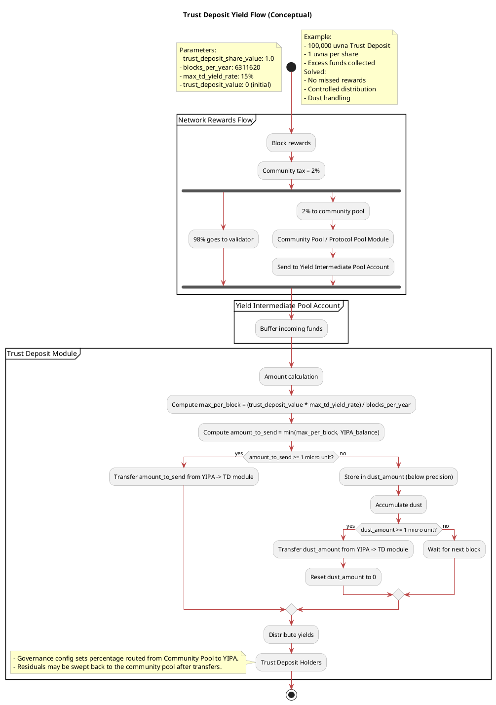

# Trust Deposit Yield Distribution – High-Level Design

## Overview

This document specifies how to extend the Verana chain to fund, accrue, and distribute Trust Deposit (TD) yield sourced from protocol rewards. It draws on the `veranatest` proof of concept while generalizing the design for production. Developers should use this specification when implementing or reviewing the feature; it deliberately omits low-level scaffolding details.

## Existing POC Behavior (Reference)

The POC (`veranatest`) implements the minimum viable flow:

- Governance proposal is created to send continously a % added amount to the community Pool to the `Yield Intermediate Pool` account via `MsgCreateContinuousFund`. *
- The TD `BeginBlocker` calculates a per-block allowance from static params and, when enough dust accumulates, transfers coins from the Yield Intermediate Pool module account straight into the TD module account (`x/td/keeper/abci.go`).
- `MsgFundModule` exists primarily to work around [cosmos/cosmos-sdk#25315](https://github.com/cosmos/cosmos-sdk/issues/25315) by seeding module accounts and—in the TD case—incrementing `trust_deposit_value`.


* example of a governance proposal:
```json
{
 "messages": [
  {
   "@type": "/cosmos.protocolpool.v1.MsgCreateContinuousFund",
   "authority": "cosmos10d07y265gmmuvt4z0w9aw880jnsr700j6zn9kn",  // this is the governance module account 
   "recipient": "cosmos1jjfey42zhnwrpv8pmpxgp2jwukcy3emfsewffz",  // this is the Yield Intermediate Pool account
   "percentage": "0.005000000000000000",                          // This is the % taken from each the community pool contribution and sent immediately to the Yield Intermediate Pool account
   "expiry": null
  }
 ],
 "metadata": "ipfs://CID",
 "deposit": "10000000uvna",
 "title": "This is the proposal to allow continuous funding of the Yield Intermediate Pool account",
 "summary": "to send the amount to the Yield Intermediate Pool account address in order to distribute yield to the trust deposit holders",
 "expedited": false
}
```

## Goals & Non‑Goals

- **Goals**
  - Route block reward revenue stream into a dedicated yield buffer (“Yield Intermediate Pool Account”).
  - process the intermediary funds held in the YIPA and send the calculated amount at a parameterized maximum rate to the `Trust Deposit account`. Update the `Trust Deposit Share Value` and all the relevant TD variables as necessary for the Trust Deposit to implemented all its transactions (`Reclaim Trust Deposit`,`Reclaim Trust Deposit Yield` ) as per [MOD-TD-MSG-2] and [MOD-TD-MSG-3] specs.
  - Preserve existing TD share accounting so that yield accrues proportionally to holders’ shares.
  - Provide governance hooks to configure funding and operational parameters.
  - Ensure unused funds flow back to the community pool, avoiding idle balances.
  - Ensure potential fractional per block block yields are accumulated in Dust to ensure fair accumulation of yield over long period of time.
- **Non‑Goals**
  - Redesign of the core TD share model (already present in Verana specs, see [MOD-TD-MSG-1-7]).
  - Changes to withdrawal logic or TD module.

## Architectural Components

| Component | Responsibility |
| --- | --- |
| `x/protocolpool` | Provides its own module account to hold community funds and sends the community-tax funds to the `Yield Intermediate Pool` account.  |
| **`Yield Intermediate Pool` account** | Module account that buffers continuous funding before TD consumption. |
| `x/td` module | Module managing the user trust deposits |
| `trust_deposit` account | Account holding the trust deposit on behalf of the account. |


## Module account (`x/td`)

TD module account:

`trust_deposit`


## Parameters (`x/td`)

Existing TD module parameters:

| Param | Type | Description |
| --- | --- | --- |
| `trust_deposit_share_value` | `math.LegacyDec` | Value of one share of trust deposit, in denom. Default an initial value: 1. Increase over time, when yield is produced. (mandatory) |
| `trust_deposit_reclaim_burn_rate` | `math.LegacyDec` | Percentage of the deposit burnt when an account executes a reclaim of capital amount. (mandatory) |
| `trust_deposit_rate` | `math.LegacyDec` | Rate used to dynamically calculate trust deposits from trust fees. Default: 0.20 (20%). (mandatory) |
| `wallet_user_agent_reward_rate` | `math.LegacyDec` | Rate used to dynamically calculate wallet user-agent rewards from trust fees. Default: 0.20 (20%). (mandatory) |
| `user_agent_reward_rate` | `math.LegacyDec` | Rate used to dynamically calculate user-agent rewards from trust fees. Default: 0.20 (20%). (mandatory) |


Extend the TD module parameters to include:

| Param | Type | Description |
| --- | --- | --- |
| `trust_deposit_max_yield_rate` | `math.LegacyDec` | Maximum annualized yield rate (e.g. 0.15 for 15%). |
| `blocks_per_year` | `uint32` or `sdk.Int` | Chain-specific estimate used when converting annual rate into per-block allowances. |
| `yield_intermediat_pool` | `string` | Bech32 string for the Yield Intermediate Pool module account (default: module addr derived from name). |


## Messages & Governance

1. **`MsgFundModule`** : allows manual funding of module accounts. Require the caller to match the module authority (defaults to the governance module account) so only authorized operations can seed TD funds. 
3. **`MsgCreateContinuousFund`** (protocol pool module, existing): Governance proposal instructing `x/protocolpool` to remit a percentage of community tax each block to the Yield Intermediate Pool account.

## Begin Block Flow (`x/td`)

Executed each block after distribution and protocol pool modules:

1. **Load Params & Dust**: `params := k.GetParams(ctx)`, `dust := k.GetDustAmount(ctx)`.
2. **Compute Allowance**:
   ```javascript
   allowance := dust + `trust_deposit` * `trust_deposit_max_yield_rate`/ `blocks_per_year`
   ```
3. **Check Balance**: `trust_deposit`.available()
4. **Determine Transfer**:
   - `transfer_amount` = min(`allowance`,`yield_intermediat_pool`).TruncateInt()
   - `dust` = min(`allowance`,`yield_intermediat_pool`).remainder()
5. **Pull Funds**:
   - transfer `transfer_amount` from `yield_intermediat_pool` to `trust_deposit`
6. **Credit TD Ledger**:
   - Ensure the TD module’s existing accounting observes the increased module balance (no new interface required; Verana already exposes share ownership and reacts to balance changes). If the parameters cache `trust_deposit_total_value`, refresh it from the authoritative TD data that already exists.
7. **Update Dust**:
   - `remaining := totalDec.Sub(decFrom(transferInt))`
   - `k.SetDustAmount(ctx, remaining)`
8. **Sweep Excess** (optional but recommended):
   - After crediting yield, read Yield Intermediate Pool balance again.
   - If non-zero, send residual back to community/protocol pool account (module-to-module transfer) to keep the buffer empty.

Every step must log context-rich messages for operations observability.

**Justification vs POC:** Steps 3–8 mirror the POC flow but make existing gaps explicit: partial payouts (step 4) and sweep (step 8) ensure funds do not stall. Step 6 simply clarifies that existing TD accounting must recognize the balance increase; no additional share logic is specified here.

## Trust Deposit Ledger Integration

The existing TD ledger already maintains a mapping of accounts to shares:

- **Expectations**: yield injections should increase the pool value without changing individual share counts.
- **Interface expectations**: No new methods are required for this feature. Continue to use whatever Verana already exposes to read total TD value (if needed for params) and to maintain share price invariants. If the TD module infers value strictly from its module account balance, no extra plumbing is necessary.

Share ownership is a separate concern, already solved in Verana. This specification assumes that layer continues to function once additional funds reach the TD module account.

## Admin Flow

1. **Governance Funding Setup**
   - Submit `MsgCreateContinuousFund` targeting the Yield Intermediate Pool account with the desired percentage (e.g. 0.05% of community tax).
   - Include metadata documenting the TD module’s use of funds and the expected burnDown.
2. **Parameter Initialization**
   - Governance issues `MsgUpdateParams` (or `param-change` proposal) to set:
     - `trust_deposit_max_yield_rate`
     - `blocks_per_year`
     - (Optionally) `yield_intermediate_pool_address`
3. **TD Ledger Alignment**
   - Ensure operational runbooks make it clear how total TD value is measured today (module account balance vs. dedicated keeper state). If the value is cached in params for rate calculations, schedule periodic syncs from the trusted TD source.
4. **Monitoring**
   - Dashboard/CLI queries reference new endpoints:
     - `QueryParams` — verify configuration.
     - `QueryDust` (optional addition) — track accumulated dust above micro precision.
     - Bank queries on the Yield Intermediate Pool account should remain near zero outside short-lived per-block spikes.

## Payment Flow Summary

```
Community Tax → Protocol Pool → (governance) Continuous Fund → Yield Intermediate Pool →
BeginBlock (x/td):
  compute allowance
  pull min(allowance, balance)
  forward to x/td ledger (ApplyYield)
  adjust dust + sweep excess back
Result: TD share value increases; per-holder positions grow automatically.
```

By crediting the TD ledger, individual holders accrue yield proportionally without new messages or manual claims.

## Handling Prior Gaps

| Gap Observed in POC | Production Resolution |
| --- | --- |
| Hard-coded addresses/denom | Parameterize addresses, derive denom via bank/mint params. |
| No partial payout when funding < allowance | Use `min(allowance, yieldIntermediatePoolBalance)` to transfer whatever is available. |
| Funds stranded in intermediate pool | Post-transfer sweep back to community pool. |
| Parameter validation empty | Implement strict validators (non-negative, rate bounds, etc.). |
| Unlimited `MsgFundModule` targets | Enforce allowlist and update `trust_deposit_total_value` only when TD is funded via ledger API. |
| Missing ledger integration | Document how existing TD accounting observes balances; no new interfaces are required, just ensure value tracking matches expectations. |
| FundModule workaround | Keep the existing workaround comment and logic until the upstream SDK bug is resolved; document its purpose for reviewers. |

## Testing Guidelines

- **Unit tests** for BeginBlock cases:
  - Exact multiple of micro units (no dust).
  - Dust accumulation leading to transfer.
  - Available balance < allowance.
  - Empty Yield Intermediate Pool (no transfer, dust persists).
- **Integration tests**:
  - Governance proposal wiring from protocol pool to Yield Intermediate Pool → TD module.
  - Verification that TD share values change without altering share counts.
  - Parameter update governance path (positive + failure cases).
- **Invariants**: Ensure total coins in TD ledger + Yield Intermediate Pool equals protocol pool contributions minus sweeps.

## Developer Notes

- Maintain deterministic ordering in BeginBlock so TD runs after distribution and protocol pool.
- Ensure migrations update params with new fields and initialize dust record if absent.
- Provide CLI/REST handlers mirroring existing module patterns (`query params`, `tx fund-module`, etc.).
- Document operator playbooks alongside this spec in chain operations docs.

